This guide walks you through the process to configure the FlexVPN Gateway in Alibaba Cloud for
integration with [Google Cloud VPN Services][cloud_vpn]. This information is
provided as an example only. Please note that this guide is not meant to be a
comprehensive overview of IPsec and assumes basic familiarity with the IPsec
protocol. Users should verify this information via testing.

[cloud_vpn]: https://cloud.google.com/compute/docs/vpn/overview

## Introduction
This guide walks you through the process of configuring the Alibaba Virtual Private Cloud (VPC) Network Gateway (also referred to as the VRouter within the Alibaba console) for integration with the [Google Cloud VPN service](https://cloud.google.com/compute/docs/vpn/). This information is provided as an example only.  If utilizing this guidance to configure your Alibaba Cloud implementation, be sure to substitute the correct IP information for your environment. Also note, this guide is not meant to be a comprehensive overview of IPsec and assumes users have a basic familiarity with the IPsec protocol.

## Topology
This guide will describe the following VPN topology:

1.	A site-to-site policy based IPSec VPN tunnel configuration using static routing
                     

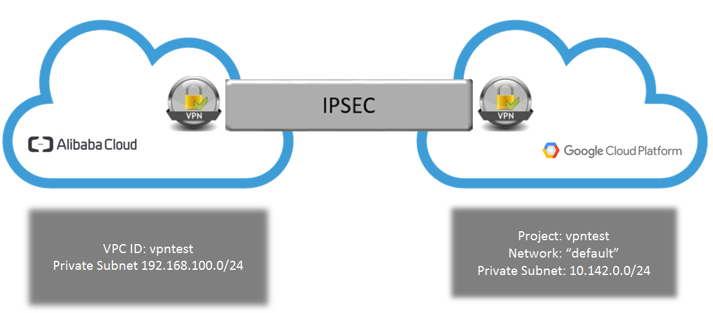
 
## Preparation

Overview

The configuration samples which follow include numerous value substitutions provided for the purposes of example only. Any references to IP addresses, device IDs, shared secrets, account information or project names should be replaced with the appropriate values for your environment when following this guide. 

This guide is intended to assist in the creation of IPsec connectivity to the Google Cloud. The following is a high level overview of the configuration process which will be covered: 

●   Configuring the Alibaba Virtual Private Cloud
●   Configuring the Alibaba Virtual Switch (VSwitch)

●   Configuring the Alibaba IPsec VPN Gateway (FlexGW)
●   Configuring the Google Cloud Platform VPN using the default network
●   Setting up the VPN Connection 
●   Connecting to GCP 
●   Configuring the Alibaba Virtual Router (VRouter)
●   Testing the tunnel 

The IPsec connectivity will utilize a pre-shared key (PSK) that you provide for authentication.

## Getting Started

The first step is to establish the base networking environment in Alibaba Cloud. Alibaba provides [documentation ](https://www.alibabacloud.com/help/doc-detail/53902.htm)for getting started with Alibaba Cloud networking. The basic concepts to understand are:

1)	**VPC 
**Virtual Private Cloud (VPC) is a private network established in Alibaba Cloud. VPCs are logically isolated from other virtual networks in Alibaba Cloud. VPCs allow you to launch and use Alibaba Cloud resources in your VPC. 

Alibaba Cloud provides a default VPC and VSwitch in the situation that you do not have any existing VPC and VSwitch to use when creating a cloud product instance. A default VPC and VSwitch will be created with the creation of an instance

2)	**VSwitch **
A VSwitch is a basic network device of a VPC and used to connect different cloud product instances. When creating a cloud product instance in a VPC, you must specify the VSwitch that the instance is located

3)	**VRouter **
A VRouter is a hub in the VPC that connects all VSwitches in the VPC and serves as a gateway device that connects the VPC to other networks. VRouter routes the network traffic according to the configurations of route entries.

4)	**Route Entry **
Each entry in a route table is a route entry. A route entry specifies the next hop address for the network traffic destined to a CIDR block. It has two types of entries: system route entry and custom route entry.

5)	**Route Table **
A route table is a list of route entries in a VRouter.

## Configuration - Alibaba Cloud
Task 1: Alibaba Cloud VPC Configuration

To get started, login to the Alibaba Management Console and select Virtual Private Cloud from the **Products & Services **menu on the default homepage. New Alibaba accounts will have a default VPC. 

For this example, create a new VPC to connect to the Google Cloud Platform using the Alibaba VPC Wizard: 

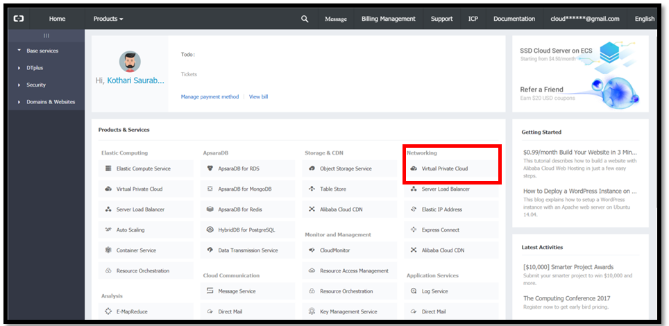

Step 1	Click "VPC" in the left pane window, followed by the Region (eg: US East (Virginia)) then the **Create** **VPC **button
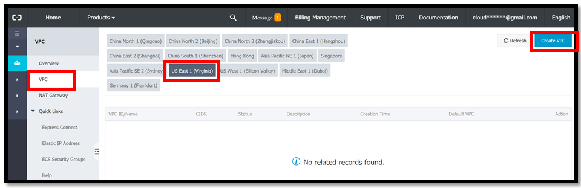
Step 2	Configure the VPC settings:
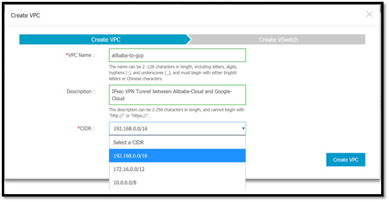

The following settings are to be configured:
1)	**VPC Name **- Enter the name of the VPC
2)	**Description **- Add a description for the VPC
3)	**CIDR **- Specify the IP address range for the VPC in the form of a Classless Inter-Domain Routing (CIDR) block

Step 3	After completing the form, click on **Create VPC **to proceed to the next step

 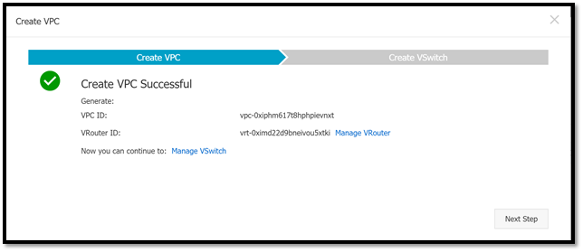
Step 4	Click on **Next Step**
Step 5	Configure the VSwitch settings
 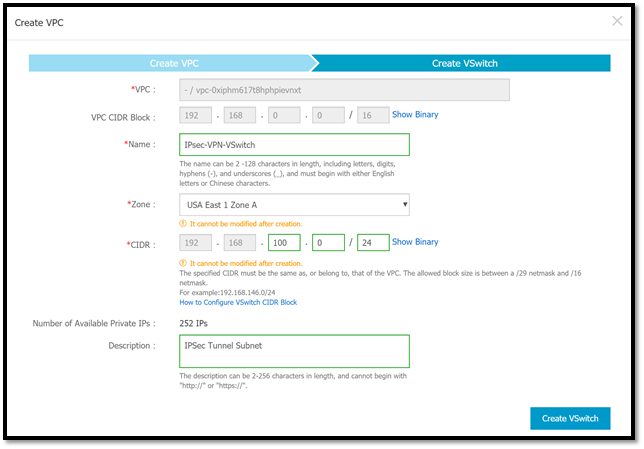
The following settings are to be configured:
1)	**VSwitch Name **- Enter the name of the VSwitch
2)	**Zone **- Select a zone of the VSwitch. Zones are physical areas with independent power grids and networks in one region. Alibaba recommends creating different VSwitches in different zones to achieve disaster recovery.
3)	**CIDR **- Specify the VSwitch IP address in the CIDR block form
4)	**Description **– Add a description for the VSwitch

Step 6	Click on **Create VSwitch**

 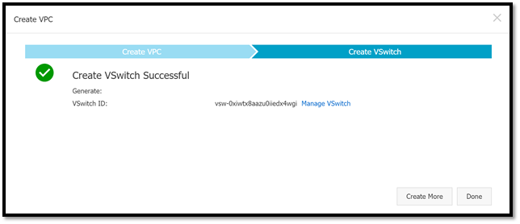
Step 7	Click on **Done**
The VPC configuration is now complete.

 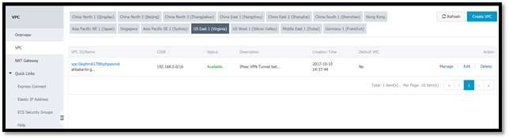

Task 2: Alibaba Cloud VPN Configuration - Configuring Alibaba IPSec VPN Gateway

Now that we have created a VPC and VSwitch, we will configure an IPSec VPN Gateway.
We will use **FlexGW IPsec VPN on CentOS**, a popular open source web-based VPN gateway available in the Alibaba Marketplace.  

FlexGW IPSec VPN on CentOS is Alibaba Cloud’s officially recommended enterprise-class VPN gateway solution. As a security gateway, it meets the business needs of mobile users who want to work everywhere with Internet access as well as meet other hybrid cloud communication needs. More importantly, its web management interface provides users with a fast, easy to use, low technical threshold remote access experience.

Configuration Steps 

Step 1	Get the **FlexVPNGW VPN gateway **from Alibaba Marketplace
a.	Click the "VPN FlexGW IPsec VPN on CentOS 6.5" icon that appears in the Alibaba Marketplace webpage at [https://www.alibaba.com/marketplace](https://www.alibaba.com/marketplace)
b.	(Optionally) Search for “flexgw” in the search box.

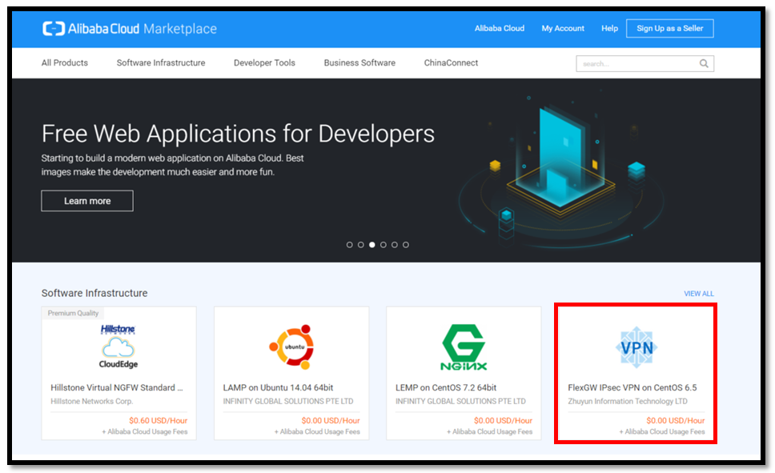
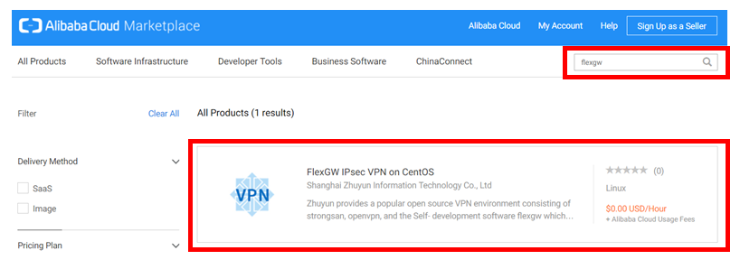
c.	Choose your preferred Region and Pricing Plan
(Note: The pricing plan is NOT for the FlexGW IPsec VPN gateway software but for the CentOS virtual ECS instance required to run the software. You can use the ecs.xn4.small instance provided as the default.) 
 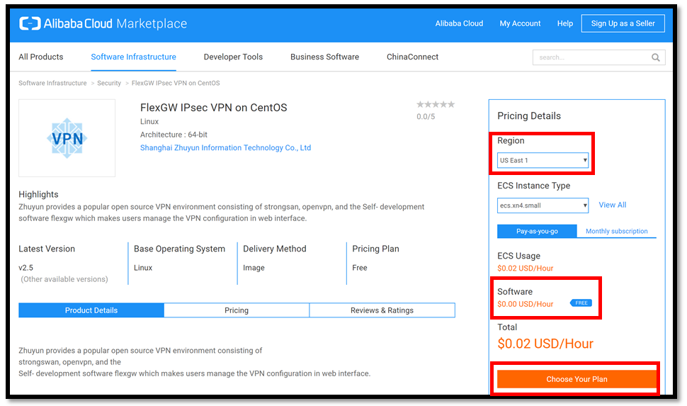
d.	Click **Advanced Buy **then click on **Launch with ECS**. The Advanced Buy option will redirect you to the ECS Advanced Purchase page where you can choose specific instance configurations (eg: Datacenter Region and Zone, instance type, network type, security group, Operating System, etc.)

 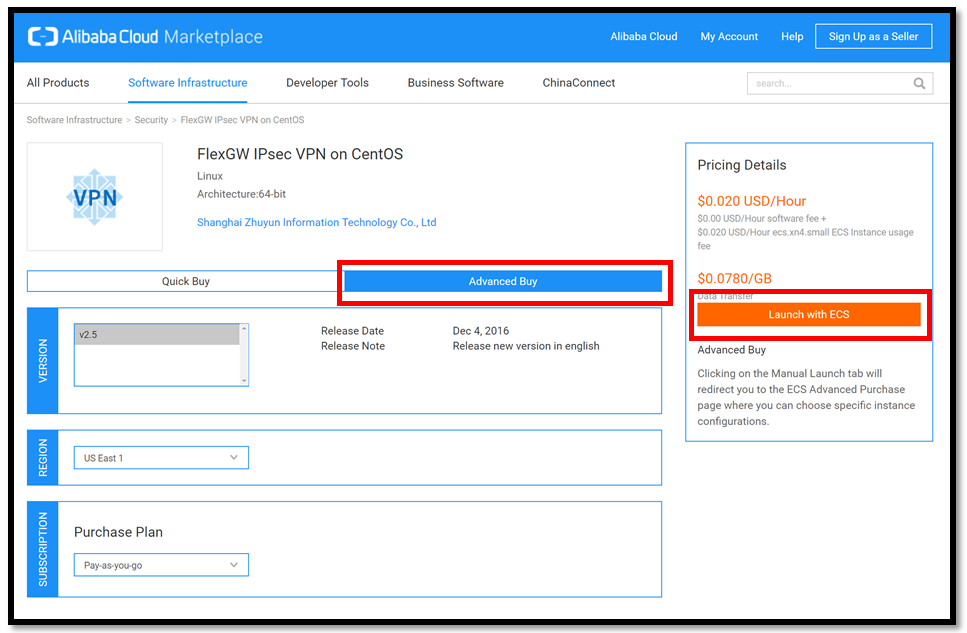

e.	Under **Advanced Purchases**, Choose the **Datacenter Region **and **Zone**.

 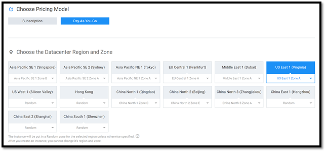

f.	Under **Instance Type**, Choose your preferred Instance Type.
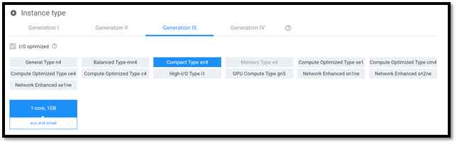
 

g.	Choose the **VPC **and **VSwitch **instance created from a previous task.

h.	Choose the Default Security Group provided. If a default security group is not an option, create and enable a new Security Group that allows **HTTP Port 80**, **HTTPS Port 443**, **ICMP Protocol**, **SSH Port 22**, and **Remote Desktop Port 3389**:
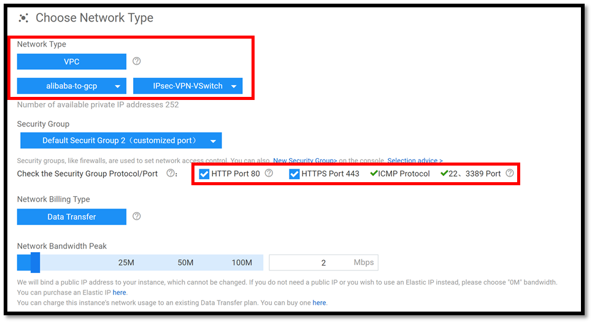
 

i.	Leave the Operating System to default (eg: FlexGW IPSec VPN on CentOS)

 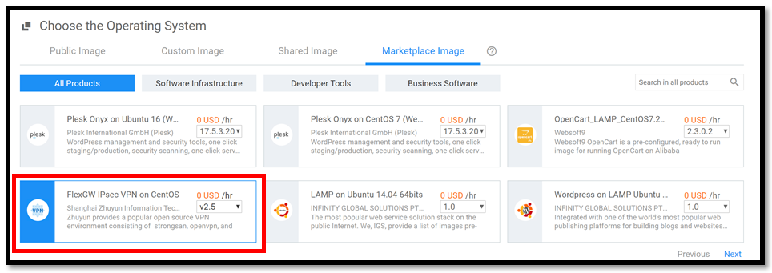

j.	Under **Security Setting**, configure the password to access the FlexGW VPN UI. Write this password down somewhere as you will need this later to access the FlexGW VPN gateway’s web interface.

 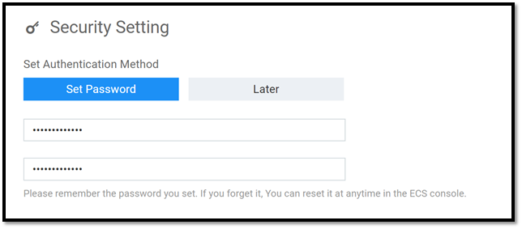

k.	Under **Purchase Plan**, Enter an Instance Name

 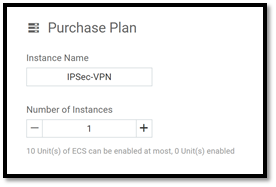

l.	Overview the configuration and Click on **Buy Now**

 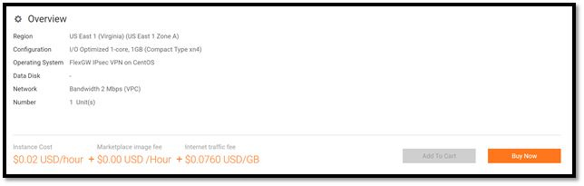
m.	Confirm the configuration then click on **Activate**
 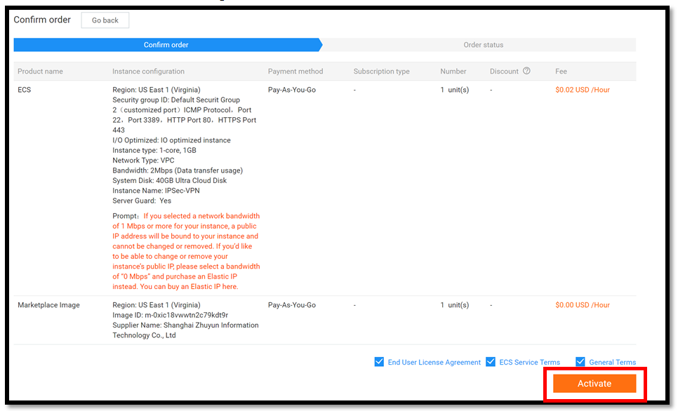
n.	Click on **Console**

 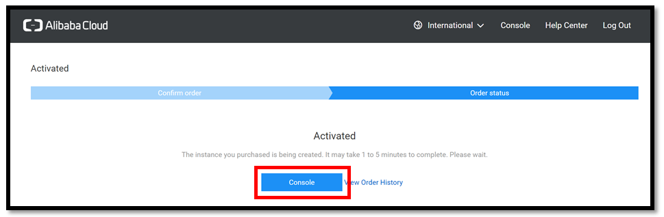
o.	Check that your ECS instance running the FlexGW VPN gateway is up and running

p.	Note down the Internet IP Address once it is in Running state. This is the address you will use in Google Cloud to peer with to bring up your tunnel.
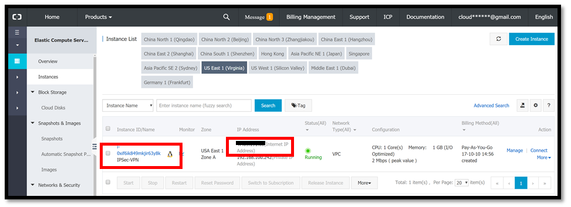 

Step 2	Configure the FlexGW VPN Gateway
a.	In a separate browser tab enter https://<Internet_IP_Address_of_FlexGW_VPN>
You will be presented with the FlexGW login portal
 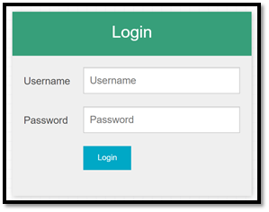

b.	Enter the access credentials using username "root" and the password you wrote down during the installation of the FlexGW VPN software.  Click on Login. 
 		You should now be presented with the FlexGW homepage:
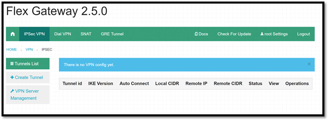
 
c.	Click on **Create Tunnel**
 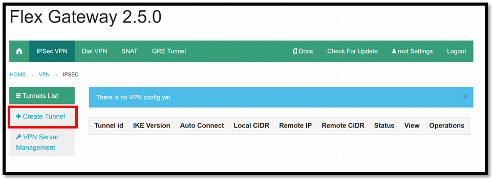

d.	Configure the Tunnel settings
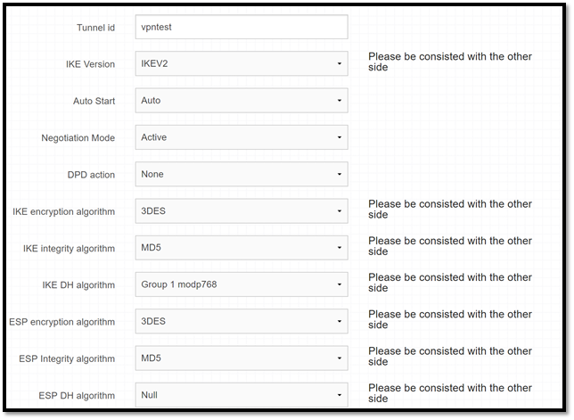
 
The following settings must be configured (you may leave other options as default)
1)	**Tunnel ID** - Enter the Tunnel ID (Ensure the ID is consisted on both sides)
2)	**IKE Version** – Choose IKE Version (this must correspond to the IKE version on Google Cloud)
3)	**Auto Start **– Select Auto  from the drop down
4)	**Local ID** – Internet IP Address of the FlexGW Instance 
5)	**Local Subnet** – VSwitch CIDR (eg: 192.168.100.0/24)
6)	**Remote ID** – Public IP Address of the Google Cloud VPN GW (leave blank unless you already know)
7)	**Remote IP** - Public IP Address of the Google Cloud VPN GW (leave blank unless you already know)
8)	**Remote Subnet** – CIDR at the Google Cloud end (eg: 10.142.0.0/24)
9)	**PSK** – Enter a value (This must be used while configuring Google Cloud, note it down)  (Example used: “letmein”)

e.	Move to the next section (eg: Google Cloud VPN Configuration) to gather Remote ID & Remote Subnet from GCP and return here to proceed with Step 3 below.

Step 3	Enter the **Remote IP** and **Remote Subnet** details here
 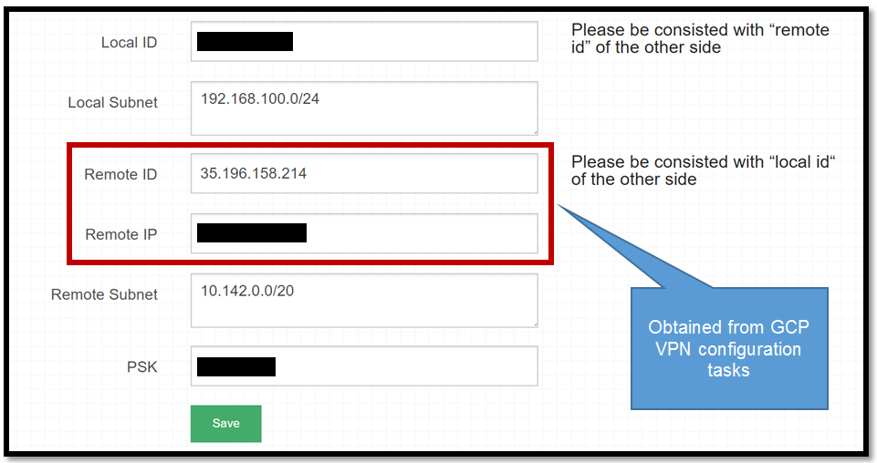
Step 4	Click on Save
 

The expected behavior at this stage is for the creation to complete, but not successfully connect since the configuration on the GCP side is not yet complete.  At this stage the IPsec pre­shared key (PSK), the Alibaba VPN Gateway Public IP address and Alibaba VSwitch CIDR are required on the GCP side which we will now populate.

Step 5	Return to GCP VPN Configuration Wizard and skip to Step 8 below under the Google Cloud VPN Configuration task.

Configuration - Google Cloud

For this exercise, a Project has already been created and the default Network setting will be used. You may create additional projects and networks to meet specific requirements.

Task 1: Google Cloud VPN Configuration
Step 1	From the GCP console menu located in upper left hand corner,  , navigate to Networking > **Interconnect **> **VPN**
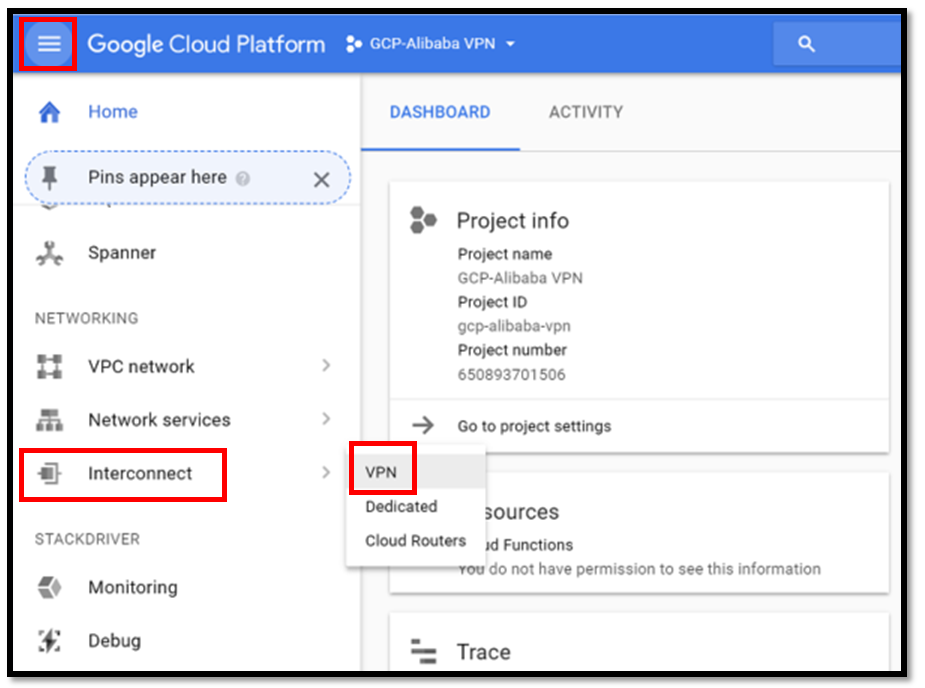 
Step 2	Click on **Create VPN Connection **
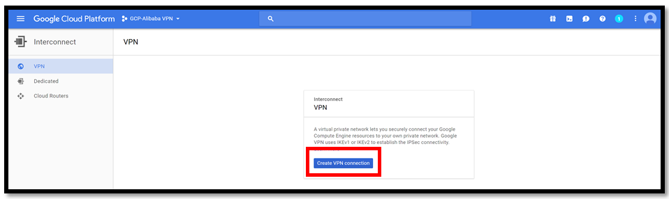
Step 3	Configure the VPN settings
a.	**Name **– vpntest 
b.	**Description **– your preferred description
c.	**Network **– default
d.	**Region **– us-east1
 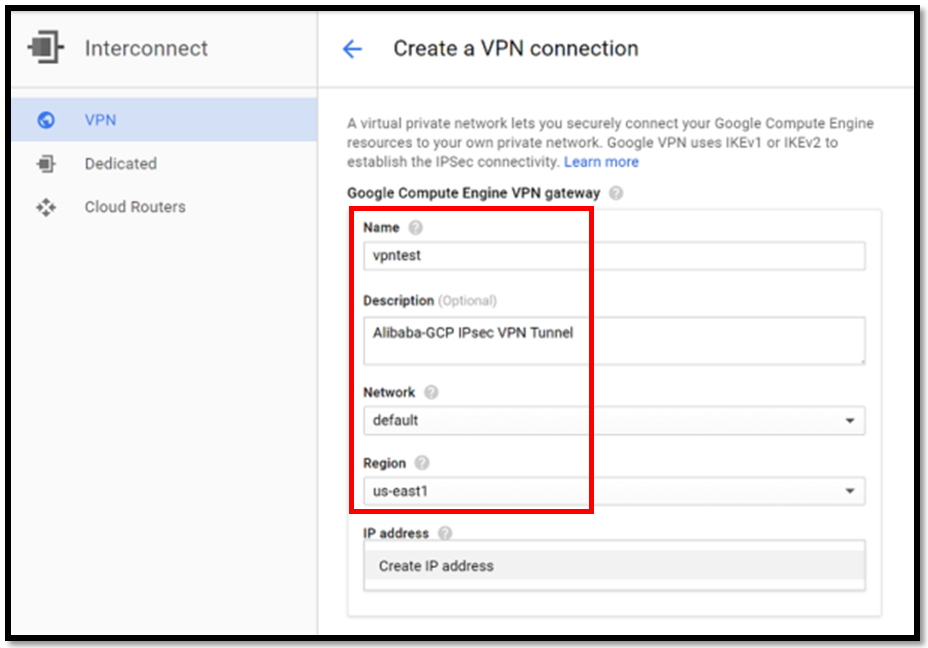
e.	**IP Address **– Click Create IP Address
i.	Provide the Name and description and Click **Reserve**

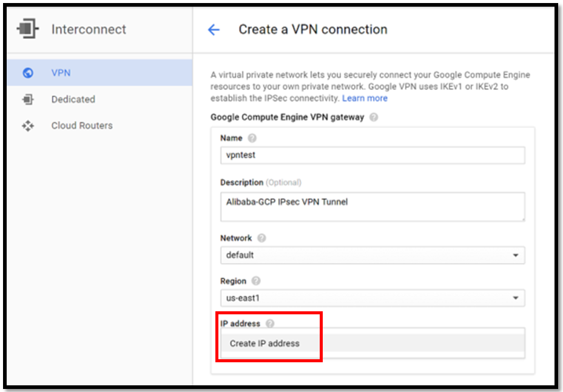
Step 4	 
 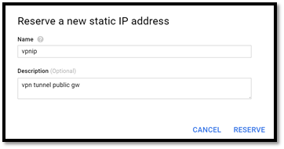

Step 5	Notice that a public IP address is generated. Note down the public IP address.  You will need this when you go back to the FlexGW VPN configuration tool to complete the VPN setup in Alibaba.
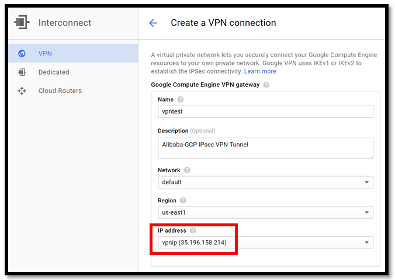
 
Step 6	Scroll down to **Local subnetworks **and select an available local subnetwork (eg: 10.142.0.0/20). Click OK. 
 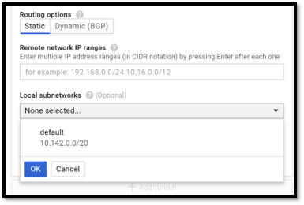

Step 7	Return to the Alibaba FlexGW VPN Configuration wizard to complete                                                     the Alibaba Cloud VPN Configuration then come back to this step to complete the Google Cloud VPN configuration. 

Step 8	Ensure that the FlexGW VPN Tunnel is created

 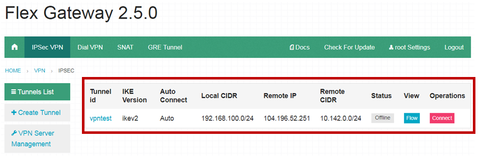

Step 9	Configure and complete the Tunnel settings in GCP

The following settings must be configured (you may leave other options as default)
1)	**Remote peer IP Address **- Enter the FlexGW Public (Internet) Address
2)	**IKE Version **– Choose IKE Version (this must correspond to the IKE version on Alibaba Cloud)
3)	**Shared secret **– PSK configured on FlexGW VPN Tunnel (eg: "letmein")
4)	**Remote network IP ranges **– Enter Alibaba VSwitch CIDR (eg: 192.168.100.0/24)
**Local Subnet **– Select Default
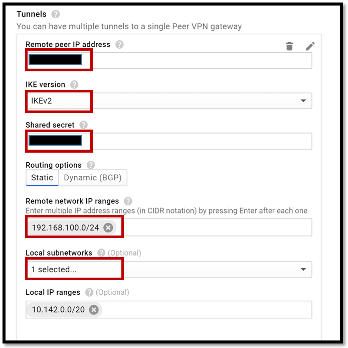

Step 10	Click on **Create **

Once complete the VPN will attempt to connect. If the VPN successfully connects, a green check will mark the remote peer IP.   Note that by default, new GCP Projects are deployed with default firewall rules in place allowing SSH, RDP and ICMP traffic from any source. If you have specific traffic requirements, a firewall rule will need to be created allowing the inbound traffic from the Alibaba source network on the required ports.

Step 11	Ensure that the VPN Tunnel is Up on Google Cloud 
 
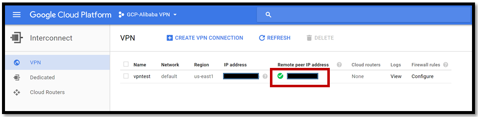
Step 12	Ensure that the VPN Tunnel is Up on Alibaba Cloud 
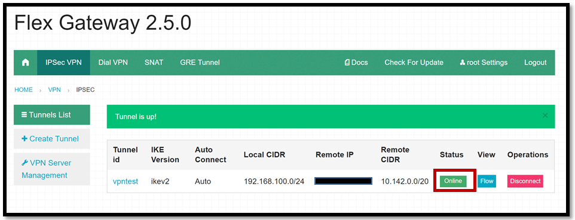
 

Step 13	 In order to route traffic from Alibaba VPC to Google Cloud via IPsec tunnel, you have to add a custom route entry for the VSwitch subnet. From the Alibaba Cloud Management Console main page:
a.	Click on Virtual Private Cloud > VPC > Your VPC ID/Name > **VRouter**
b.	Click on **Add Route Entry**

 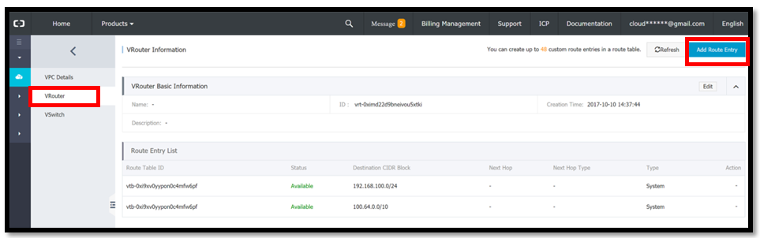c.	Configure the route settings

The following must be configured:

1)	**Destination CIDR **– The destination Subnet (GCP network CIDR)  
2)	**Next Hop Type **– ECS Instance
3)	**ECS Instance **– Select the FlexGW VPN Instance

 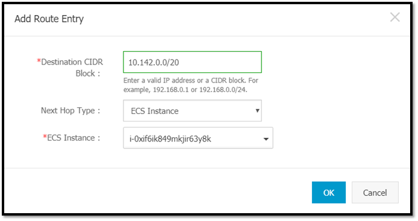
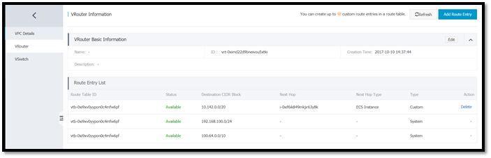 

## Configuration - Verification

With the site to site now VPN online, the tunnel is ready for testing. 

To test, create virtual machines in both Alibaba and Google Compute Engine.

Once virtual machines have been deployed on both platforms, an ICMP echo test can ensure network connectivity.  

Below is an example of a functional tunnel passing ICMP packets between a virtual machine instance in Alibaba Cloud and GCP.

Alibaba ECS virtual machine pinging the virtual machine in GCE
 
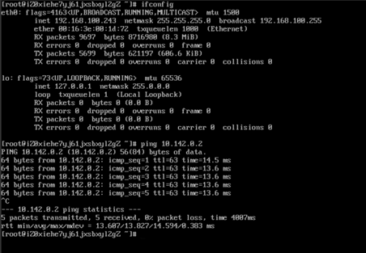
GCE virtual machine pinging the virtual machine in Alibaba Cloud
 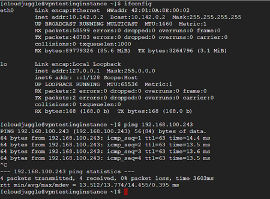
Basic Traffic Flow Displaying in FlexVPN GW Flow Portal
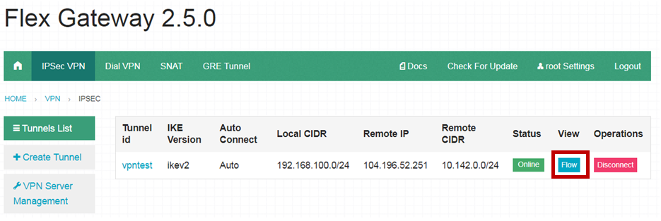 

 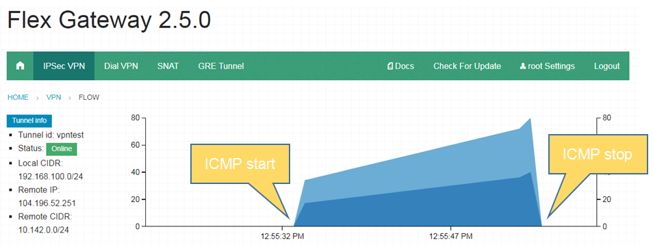

